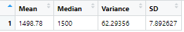

# MechaCar_Statistical_Analysis
Using R to perform statistical analysis on car manufacturing data. 

## Linear Regression to Predict MPG

Using vehicle performance data on the MechaCar prototype, we can see which physical features most affect the car's mpg. 

The residuals of the linear regression show how the actual data differs from the predicted amounts of the regression. The median, or MPG amount that falls in the middle of the data set was very close (-0.0692) to the linear regression. Meanwhile, the min and max MPG almost 20 miles different from predicted values: -19.4701 and 18.5849 respectively.

Reviewing the last column of the correlations will tell us the p-value of the variable, which shows statistical significance when the value is under 0.05. 

1. Features that showed a non-random correlation with mpg:

* vehicle_length 
    * p-value of 2.60e-12 (0.0000000000026)
* ground_clearance 
    * p-valule of 5.21e-08 (0.0000000521)
* vehicle-weight showed less signifcant correllation under 0.1
    * p-value of 0.0776

2. The slope of the linear regression is non-zero, meaning changes to our independent variables of vehicle length, weight, spoiler angle, ground clearance and AWD are estimated to result in positive or negative changes in the MPG. 

3. The linear model effectively predicts the car's MPG, shown by the p-value 5.35e-11 corresponding to the F-statistic. This value represents the number 0.0000000000535, which is lower than 0.05 and shows that this model is more useful than a model with no data inputs. 

## Summary Statistics on Suspension Coils

_The design specifications for the MechaCar suspension coils dictate that the variance of the suspension coils must not exceed 100 pounds per square inch. Does the current manufacturing data meet this design specification for all manufacturing lots in total and each lot individually? Why or why not?_

Reviewing data from all manufacturing lots totaled together, the production of suspension coils does meet the design specifications although there is room for improvement. The summary statistics below show the variance of 62 punds per square inch, whereas the design specifications for the MechaCar suspension coils dictate that the variance must not exceed 100 pounds per square inch.

Analyzing the data from each lot individually, we see that Lot 3 suspension coils are not meeting the design specifications. At Lot 3, suspension coil pressure exceeds the design specifications with a variance of 170.29 punds per square inch. 

The suspension coils at lots 2 and 3 meet the requirements with variances of 0.98 and 7.47 pounds per square inch respectively.

## T-Tests on Suspension Coils

Drilling into the PSI data points, we can perform t-tests to test the likelyhood of predicting the mean of the data across all manufacturing plants, and by individual manufacturing lot. 

The results of the t-test of all data together shows the mean PSI of 1500 is not a good predictor for the dataset. The p-vallue is 1, which is over the significance value of 0.05 percent. 

The below t-test analyzes the PSI values from suspension coils at manufacturing lot 1. Due to the low, near-zero p-value, the mean of the data is statisticallay significant and a good predictor for the PSI of suspension coils made at this facility.

The below t-test analyzes the PSI values from suspension coils at manufacturing lot 2. The p-value of 0.0005911 is below the significance level of 0.05, the mean of the data is statisticallay significant and a good predictor for the PSI of suspension coils made at this facility.

The below t-test analyzes the PSI values from suspension coils at manufacturing lot 3. The p-value of 0.1589 is above the significance level of 0.05, which means the average value of PSI for the overall production data is not statistically significant in predicting the the PSI of suspension coils made at this facility.

## Study Design: MechaCar vs Competition

We can use similar statistical testing to examine MechaCar's performance against the competition. We seek to understand how the initial cost of MechaCars is offset by the ongoing maintainance and fuel costs compared to other car makers. By summarizing data from different car makers we can use the following data points to analyze the cost of owning each car and how long to expect to use it:

The metric we will use to gauge the cost analysis is the rate of change of gas mileage against the age of vehicle. We will also look at the number of years it takes to save $2500 in gas compared to other cars in the size bracket. 

Hypothesis: Over the first five years of the MechaCar vehicle lifespan, the rate of change of the gas mielage is less than, or equal to 0.1. 

Viewing car useage data and mileage data of hybrid cars from 4 different automakers, we can fit the mileage and age data to a linear regression to see if the slope of the line, or rate of change. The statistical analysis will follow these steps:

1. Group the car data by maker and by age (years).
2. Calculate the average miles per make and gallon on each year of data.
3. Perform a t-test on each of the miles per gallon data sets to test the statistical significance of the mileage per make. 
    _If the average mileage data is not statistically significant then it can be shown that the maker in question has not built a reliable vehicle when compared to MechaCar_
4. Perform linear regression on age (x) versus average gas mileage (y).
5. Calculate the summary statistics on the linear regression and analyze the p-value score to ensure that the line matches to the data with a statistical significance of 0.01.

For the null hypothesis to be true, the linear regression must have a p-value of less than 0.01, as well as show that the rate of change (slope) of the linear regression is less than or equal to 0.1. This will show that the car will have a reliable cost of gas, and will help us predict the amount of savings or cost comparison to other makers per year. This data can be used to justify the potentially higher cost of MechaCar hybrid model against the competition, showing that the fuel savings for the first 5 years will be greater than the difference in the car's initial cost. 

